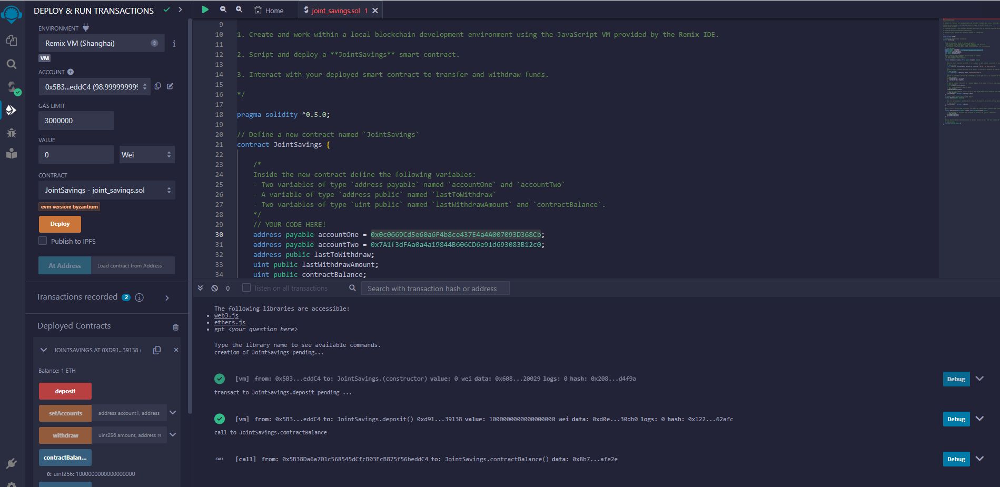
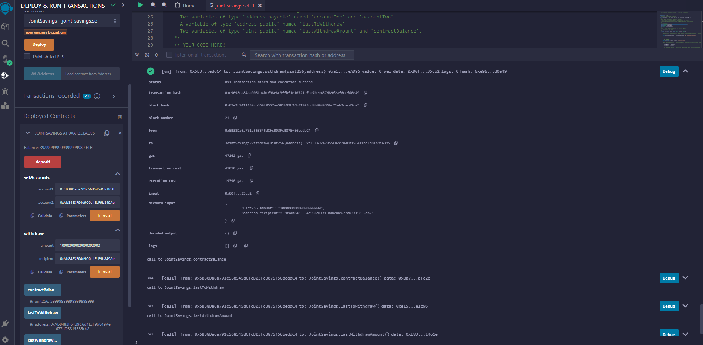
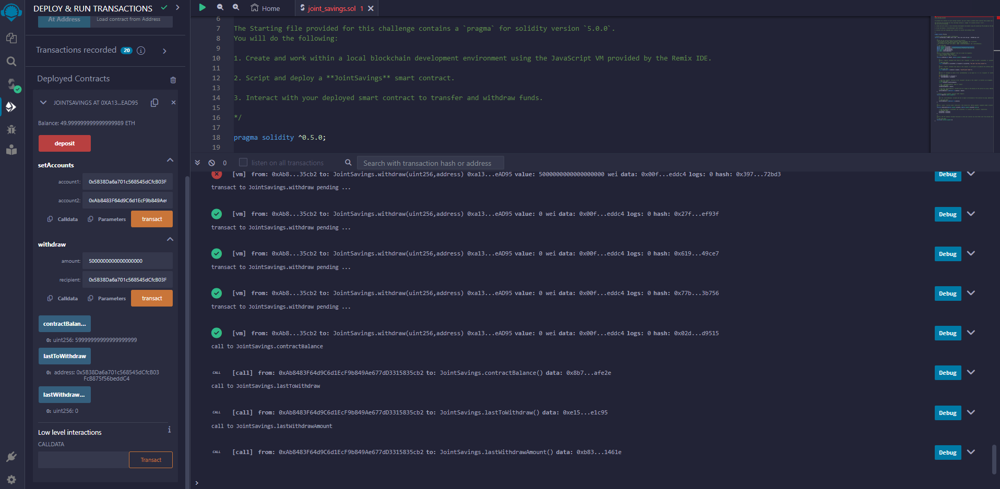

# Smart_Contract
I have recently been hired by a fintech startup company. This company is disrupting the finance industry with its own cross-border, Ethereum-compatible blockchain that connects financial institutions. Currently, the team is building smart contracts to automate many of the institutions’ financial processes and features, such as hosting joint savings accounts.

To automate the creation of joint savings accounts, I created a Solidity smart contract that accepts two "dummy" user addresses to test the performance of the smart contract. These addresses will be able to control a joint savings account. The smart contract will use ether management functions to implement a financial institution’s requirements for providing the features of the joint savings account. These features will consist of the ability to deposit and withdraw funds from the account.

The below screenshot shows the successful deployment of the smart contract that I have encoded.

I then tested out the performance ability of the smart contract by sending 1 ether as wei between the dummy accounts, as seen below. 

Secondly, I further  tested out the performance ability of the smart contract by sending 10 ether as wei between the dummy accounts, as seen below. 

Finally, to finsih the testing performance of the smart contract, I sent 5 ether between the dummy accounts, as seen below. 

